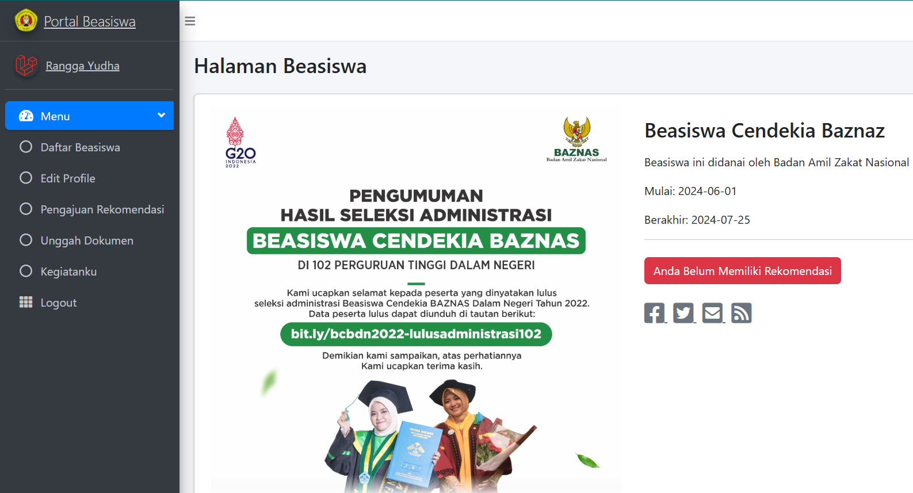

## About System
This scholarship information system is a website designed as a platform for collaboration between scholarship providers and the relevant faculty to facilitate students seeking information and registration related to college scholarships. This system is built using the Laravel framework and utilizes a template from Admin LTE 3.

## System Features
The system implements multi-user login for three user levels: faculty admin, students, and scholarship partners. These are the features provided : 
- **[Faculty Admin]**
- **[Scholarship Partner]**
- **[Student]**

## Contributing

Thank you for considering contributing to the Laravel framework! The contribution guide can be found in the [Laravel documentation](https://laravel.com/docs/contributions).

## Code of Conduct

In order to ensure that the Laravel community is welcoming to all, please review and abide by the [Code of Conduct](https://laravel.com/docs/contributions#code-of-conduct).

## Security Vulnerabilities

If you discover a security vulnerability within Laravel, please send an e-mail to Taylor Otwell via [taylor@laravel.com](mailto:taylor@laravel.com). All security vulnerabilities will be promptly addressed.

## License

The Laravel framework is open-sourced software licensed under the [MIT license](https://opensource.org/licenses/MIT).
